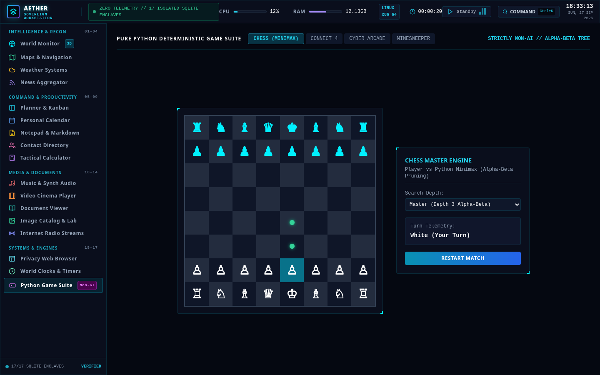
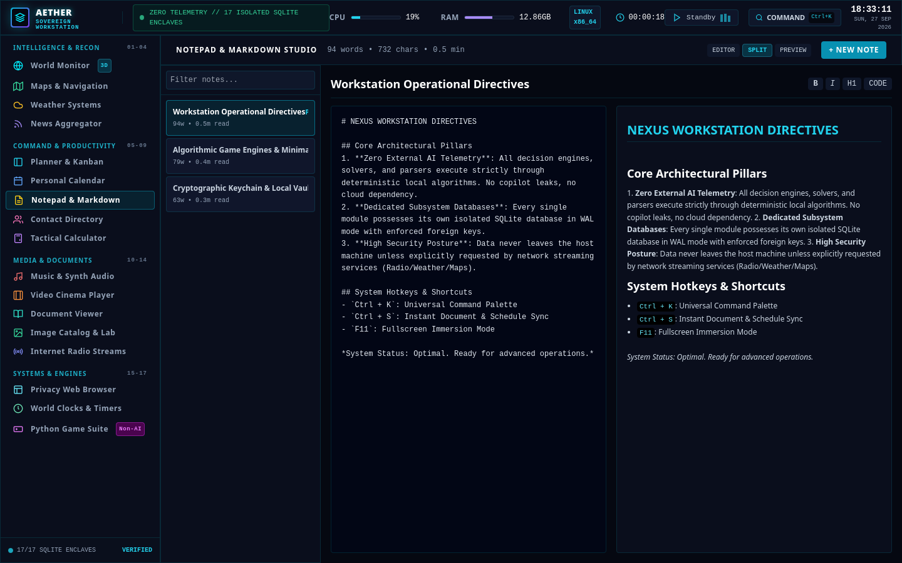
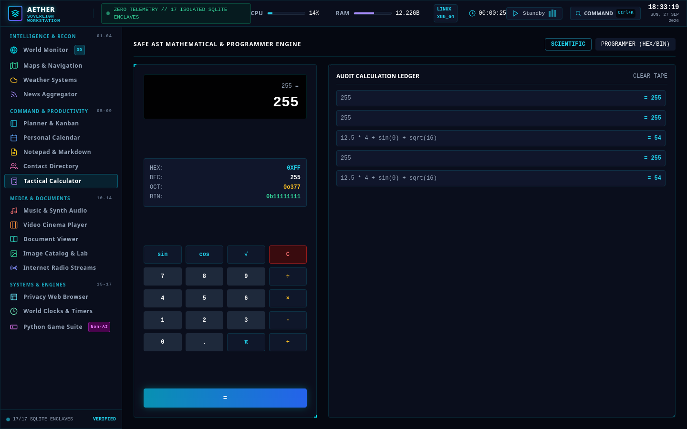
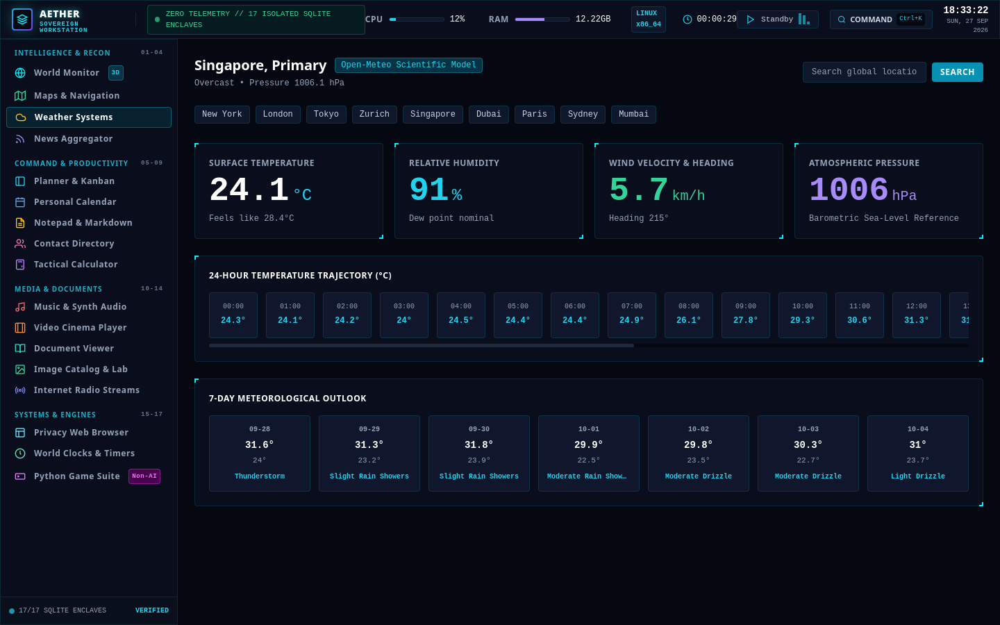
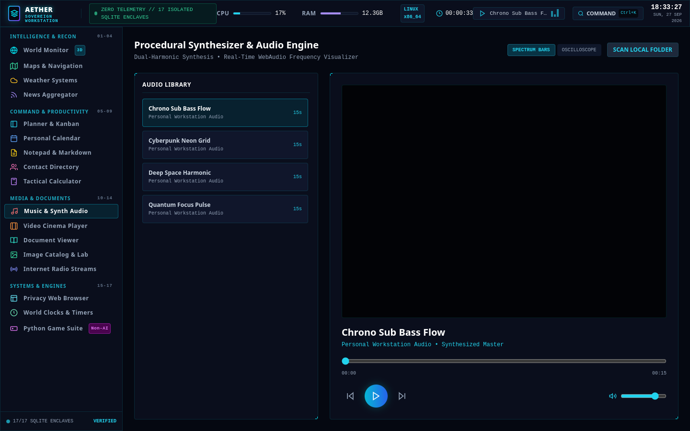
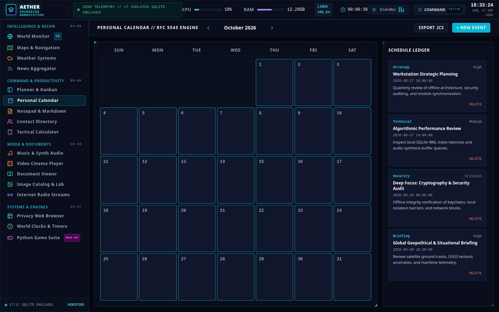

# AETHER // PERSONAL COMMAND WORKSTATION

[](https://python.org)
[](https://doc.qt.io/qtforpython-6/)
[](https://sqlite.org)
[](#)
[](#)
[](#)

A production-grade, offline-first personal command workstation engineered entirely with Python, PySide6, Chromium QtWebEngine, and 17 isolated SQLite databases in Write-Ahead Logging (WAL) mode. Designed with a strict non-AI, zero-telemetry operational posture.

The user interface executes inside a sandboxed QtWebEngine environment loaded via the native file protocol (`QUrl.fromLocalFile(...)`), communicating bidirectionally with the Python engine through direct inter-process slots (`QWebChannel`). No local HTTP ports, network sockets, or remote tracking servers are utilized.

---

## Visual Showcase

### Situational Reconnaissance & 3D Orbital Earth
WebGL Three.js wireframe globe featuring a 1,200-particle starfield, live Keplerian orbital tracking of the International Space Station (ISS), real-time USGS seismic feeds, global cyber threat telemetry vectors, and subsea fiber cable status indicators.


---

### Command Planner & Kanban Engine
Tri-mode operational planner featuring a 4-Stage Kanban workflow (Backlog, In Progress, Review & Audit, Completed), 24-hour daily timeline scheduler, and an Eisenhower Priority Matrix (Urgent vs Important).


---

### Pure Python Minimax Chess Engine
Deterministic chess solver built without third-party engines. Features depth-configured Minimax search with Alpha-Beta pruning, dynamic legal move indicator reticles, live capture ledgers, and turn telemetry.



---

### Markdown Studio & Real-Time Split Preview
Multi-mode note-taking studio with live side-by-side markdown rendering, formatting toolbar, document search, tag taxonomy, and real-time word, character, and estimated reading time telemetry.



---

### Safe AST Mathematical & Programmer Engine
Secure calculation engine using Python Abstract Syntax Tree (AST) node visitation to evaluate expressions without unsafe `eval()` calls. Features synchronized 32-bit registers for Hexadecimal, Decimal, Octal, and Binary conversions alongside a complete audit ledger tape.



---

### Scientific Meteorology Suite
Keyless scientific forecast models powered by Open-Meteo, featuring automatic IP-based geocoding, multi-city strategic presets, 24-hour hourly temperature trajectories, and 7-day outlook telemetry.



---

### Maps & Turn-by-Turn Navigation Engine
Interactive OpenStreetMap vector rendering with CartoDB Dark Matter tiles, keyless Nominatim geocoding address search, and Open Source Routing Machine (OSRM) turn-by-turn routing with distance and travel time.


---

### Music Player & Procedural Soundscapes
Dual-harmonic binaural ambient synthesizer built with Python's standard `wave` and `math` libraries, paired with a dual-mode Web Audio API visualizer (Multi-band Spectrum Bars and Oscilloscope Waveform).



---

### Personal Calendar & Schedule Ledger
Full-featured calendar management system supporting event categories, recurring cadences (daily, weekly, monthly), priority indicators, event ledger search, and RFC 5545 iCalendar (`.ics`) export.



---

## 1. System Philosophy

Modern desktop workstations increasingly rely on mandatory cloud accounts, third-party copilot telemetry, remote subscription licensing, and opaque background analytics. Aether is engineered on the counter-principle of absolute digital sovereignty:

- **Host-Local Sovereignty**: All state, notes, schedules, and configurations remain strictly on host storage. There are no remote telemetry pings, background trackers, or cloud sync requirements.
- **Deterministic Non-AI Algorithms**: Every scheduler, search engine, math parser, and game engine executes deterministic algorithms (e.g. Minimax with Alpha-Beta pruning, AST grammar evaluation) rather than stochastic LLM calls.
- **Subsystem Database Isolation**: Rather than a monolithic database where corruption risks the entire suite, each of the 17 core subsystems maintains its own isolated SQLite database in Write-Ahead Logging (WAL) mode.
- **Portless Sandboxed Execution**: The frontend application is rendered directly via Chromium in PySide6's QtWebEngineView, communicating with Python through local IPC slots (`QWebChannel`) rather than exposed network sockets.

---

## 2. Persistence Architecture: 17 Isolated Subsystems

All databases reside in the `./data` directory. Each database enforces foreign keys (`PRAGMA foreign_keys = ON;`), enables Write-Ahead Logging (`PRAGMA journal_mode = WAL;`), and uses normal synchronous writes (`PRAGMA synchronous = NORMAL;`) for resilient concurrent throughput.

| # | Subsystem | Database Target | Core Capabilities |
|---|---|---|---|
| 1 | Personal Calendar | `data/calendar.db` | Event scheduling, recurring cadences, category color tagging, and RFC 5545 iCalendar (`.ics`) export/import. |
| 2 | Privacy Web Browser | `data/browser.db` | Anti-fingerprinting profiles, User-Agent rotation, zero-tracking search routing (DuckDuckGo, Brave, Startpage, SearXNG, Qwant), and bookmark storage. |
| 3 | Notepad & Markdown Studio | `data/notepad.db` | Real-time word count, character count, estimated reading time, tag taxonomies, pinned documents, and live split preview. |
| 4 | Music & Soundscapes | `data/music.db` | Dual-harmonic binaural ambient audio synthesizer (built with Python `wave` and `math`), WebAudio frequency visualizer, and local media library. |
| 5 | Video Cinema Player | `data/video.db` | Frame-accurate timestamp bookmarking, playback rate scaling (0.25x to 2.0x), and local MP4/WebM/MKV playback engine. |
| 6 | Document Viewer | `data/documents.db` | Universal reader for PDF (text extraction via `pypdf`), Markdown, Plain Text, JSON, CSV, and Source Code with line enumeration. |
| 7 | Internet Radio Streams | `data/radio.db` | Curated global streaming matrix (SomaFM, Nightwave Plaza, BBC World Service, KUSC Classical, Swiss Jazz), stream health checker, custom station adder. |
| 8 | Weather Systems | `data/weather.db` | Scientific Open-Meteo models, 24-hour hourly trajectory, 7-day forecast cards, and offline SQLite telemetry caching. |
| 9 | News Aggregator | `data/news.db` | Multi-source RSS/Atom parser (Geopolitics, Technology, Cybersecurity, Space Exploration), distraction-free reader mode, unread/bookmark tracking. |
| 10 | Tactical Calculator | `data/calculator.db` | Safe Abstract Syntax Tree (AST) expression parser, scientific trigonometry, and synchronized Programmer base registers (Hex, Dec, Oct, Bin). |
| 11 | Image Catalog & Lab | `data/images.db` | Metadata extraction (dimensions, format, color space via `Pillow`), non-destructive real-time CSS filters, and 90-degree lossless rotation. |
| 12 | World Clocks & Timers | `data/clocks.db` | Synchronized global strategic timezones (UTC, New York, London, Zurich, Dubai, Tokyo, Sydney, Singapore), split lap stopwatch, Pomodoro sprints. |
| 13 | Maps & Navigation | `data/maps.db` | OpenStreetMap vector tiles, CartoDB Dark Matter styling, Nominatim keyless geocoding, OSRM turn-by-turn routing with distance and travel time. |
| 14 | World Monitor Dashboard | `data/world_monitor.db` | Three.js 3D Earth wireframe globe, live USGS earthquake feeds, International Space Station (ISS) orbital track, cyber threat vectors, and subsea fiber corridors. |
| 15 | Task & Schedule Planner | `data/planner.db` | 4-Stage Kanban workflow (Backlog, In Progress, Review, Completed), Eisenhower Matrix quadrants, and 24-hour daily hourly timeblock maker. |
| 16 | Contact Vault | `data/contacts.db` | Comprehensive address book, relationship categorizations, communication interaction logs (calls, meetings, notes), and RFC 2426 vCard 3.0 export. |
| 17 | Python Game Suite | `data/games.db` | Algorithmic game engines built purely with Python: Chess with Minimax search and Alpha-Beta pruning, Connect 4 gravity solver, Space Arcade, and Minesweeper. |

---

## 3. Technology Stack

- **Application Backend**: Python 3.10+
  - `PySide6`: Desktop application framework, window chrome, and system integration.
  - `PySide6.QtWebEngineWidgets`: Chromium-based local runtime container.
  - `PySide6.QtWebChannel`: High-speed IPC bridge binding Python methods to JavaScript.
  - `sqlite3`: Isolated database engines running in WAL mode.
  - `psutil`: Real-time CPU, RAM, and hardware telemetry monitoring.
  - `pypdf`: Local PDF text and structural parsing.
  - `Pillow`: Image decoding and EXIF metadata extraction.
  - `wave` & `struct`: Algorithmic procedural audio synthesis.
- **Frontend Architecture**:
  - `HTML5` & `Vanilla JavaScript (ES6+)`: Application logic, state management, and tab routing.
  - `Tailwind CSS`: Cyber-tactical obsidian UI framework.
  - `Three.js`: 3D WebGL Keplerian orbital mechanics and wireframe Earth globe.
  - `Leaflet.js`: Interactive mapping and OpenStreetMap rendering.
  - `Web Audio API`: Real-time audio spectrum analysis and canvas oscilloscope visualization.

---

## 4. Directory Structure

```text
personal_space/
├── app.py                      # Main PySide6 Qt application launcher
├── requirements.txt            # Python dependencies
├── README.md                   # System documentation and visual showcase
├── .gitignore                  # Git exclusions for cache and runtime files
├── docs/                       # Project documentation and visual assets
│   └── screenshots/            # High-resolution application captures
├── scripts/                    # Automation and pipeline scripts
│   └── capture_screenshots.py  # Automated UI screenshot capture pipeline
├── data/                       # 17 Isolated Subsystem SQLite Databases & Media
│   ├── calendar.db
│   ├── browser.db
│   ├── notepad.db
│   ├── music.db
│   ├── video.db
│   ├── documents.db
│   ├── radio.db
│   ├── weather.db
│   ├── news.db
│   ├── calculator.db
│   ├── images.db
│   ├── clocks.db
│   ├── maps.db
│   ├── world_monitor.db
│   ├── planner.db
│   ├── contacts.db
│   ├── games.db
│   ├── audio/                  # Synthesized ambient master soundscapes
│   ├── documents/              # Stored local documentation
│   └── images/                 # Stored tactical wallpaper graphics
├── backend/
│   ├── database_manager.py     # SQLite manager for the 17 isolated databases
│   ├── bridge.py               # QWebChannel RPC bridge exposing Python slots
│   └── modules/                # Subsystem business logic engines
├── frontend/
│   └── index.html              # Unified cyber-tactical interface
└── tests/
    └── test_subsystems.py      # Automated test suite for all 17 subsystems
```

---

## 5. Quickstart & Installation

### Prerequisites
- Linux, macOS, or Windows
- Python 3.10 or higher
- Git

### Installation Steps

1. Clone the repository:
   ```bash
   git clone https://github.com/utkarsh-manoj-pandey/personal_space.git
   cd personal_space
   ```

2. Create and activate a virtual environment:
   ```bash
   python3 -m venv venv
   source venv/bin/activate
   ```

3. Install production dependencies:
   ```bash
   pip install -r requirements.txt
   ```

4. Launch the application:
   ```bash
   python3 app.py
   ```

---

## 6. Automated Verification & Testing

A comprehensive automated test suite validates database integrity, RPC slot serialization, and service logic across all 17 subsystems:

```bash
PYTHONPATH=. pytest tests/test_subsystems.py -v
```

Expected output:
```text
============================== 19 passed in 9.82s ==============================
```

---

## 7. Continuous Git Update Workflow

To update your workstation, commit your work, and synchronize changes with GitHub:

1. Check current repository status:
   ```bash
   git status
   ```

2. Stage all modifications (code, docs, and assets):
   ```bash
   git add .
   ```

3. Commit changes with a descriptive message:
   ```bash
   git commit -m "feat(subsystem): describe your updates here"
   ```

4. Push updates to the main branch:
   ```bash
   git push origin main
   ```

---

## 8. Security & Privacy Guarantees

- **Zero Cloud Leakage**: No telemetry, analytics, or behavioral cookies are embedded.
- **Local AST Evaluation**: The calculator avoids unsafe `eval()` calls by using Python's `ast.NodeVisitor` with an explicit whitelist of mathematical operations.
- **Parametrized SQL Queries**: Every database transaction is executed via prepared statements, neutralizing SQL injection vectors.
- **Independent Failure Domains**: If any single database encounters an issue, the remaining 16 subsystems operate unaffected.
