# AETHER // PERSONAL COMMAND WORKSTATION

[](https://python.org)
[](https://doc.qt.io/qtforpython-6/)
[](https://sqlite.org)
[](#)
[](#)
[](#)

A production-grade, offline-first personal command workstation engineered entirely with Python, PySide6, Chromium QtWebEngine, and 17 isolated SQLite databases in Write-Ahead Logging (WAL) mode. Designed with a strict non-AI, zero-telemetry operational posture.

The user interface executes inside a sandboxed QtWebEngine environment loaded via the native file protocol (`QUrl.fromLocalFile(...)`), communicating bidirectionally with the Python engine through direct inter-process slots (`QWebChannel`). No local HTTP ports, network sockets, or remote tracking servers are utilized.

---

## Visual Showcase: All Subsystems & Modules

Aether's interface is structured across 4 core operational domains comprising 19 dedicated modules. Below is the complete visual walkthrough of every subsystem, captured directly from the live workstation environment.

### Domain 1: Core Command & Geospatial Intelligence

#### 00. Executive Command Workspace & Operational Cockpit
Unified situational overview synthesizing real-time hardware telemetry (CPU, RAM utilization), pending priority agendas, calendar appointments, recent document access, global telemetry pulse (Keplerian ISS tracking & USGS seismic alert status), and pinned executive directives.

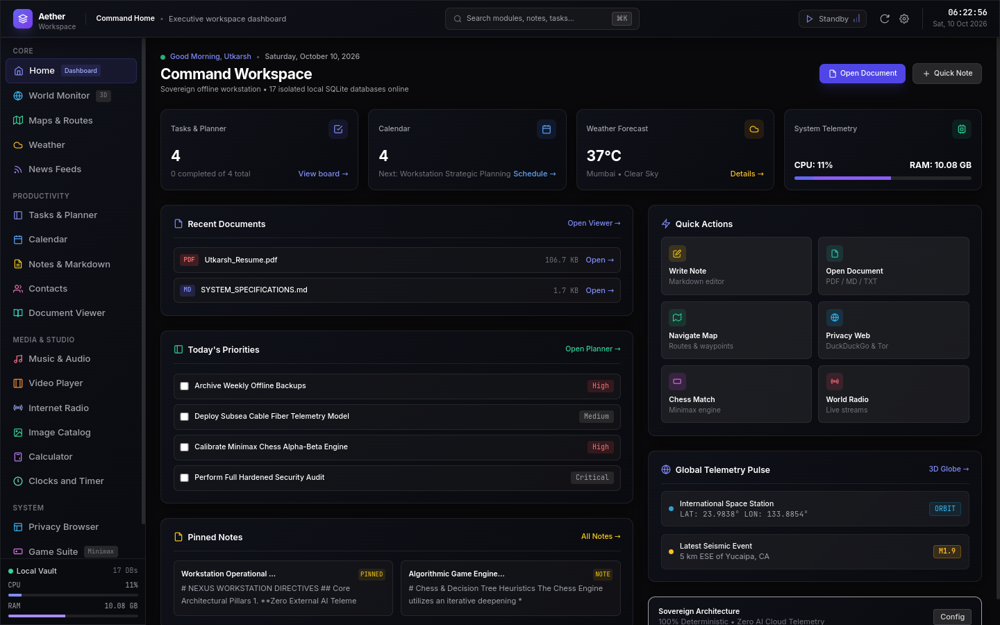

---

#### 01. Situational Reconnaissance & 3D Orbital Earth
WebGL Three.js wireframe globe featuring a 1,200-particle dynamic starfield, live Keplerian orbital tracking of the International Space Station (ISS: 27,580 km/h with live coordinates), real-time USGS seismic earthquake telemetry feeds with Richter magnitude badges, global cyber threat telemetry vectors, and subsea fiber cable corridor throughput indicators.

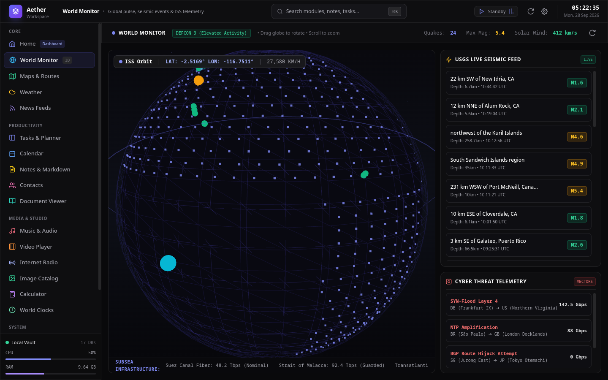

---

#### 02. Maps & Turn-by-Turn Navigation Engine
High-contrast CartoDB Dark Matter geospatial canvas integrated with Leaflet.js, keyless Nominatim geocoding engine, custom waypoints with WGS-84 ellipsoidal Vincenty geodesy calculations, and Open Source Routing Machine (OSRM) turn-by-turn driving, walking, and cycling navigation with maneuver guidance, travel durations, and distance metrics.

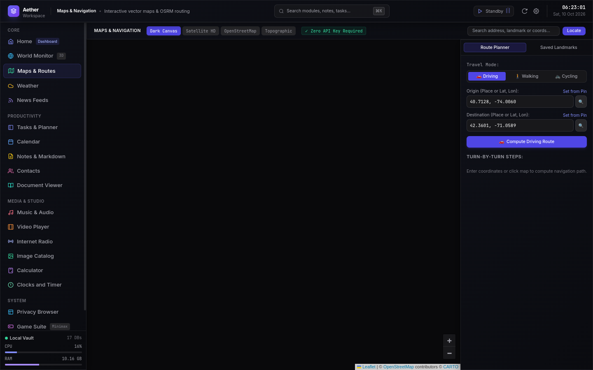

---

#### 03. Scientific Meteorology Suite
Keyless atmospheric physics and forecasting powered by Open-Meteo, featuring automatic IP-based geocoding, multi-city strategic presets (New York, London, Tokyo, Zurich, Singapore, Mumbai, etc.), real-time thermodynamic metrics (surface temperature, dew point, relative humidity, wind heading, barometric pressure), 24-hour hourly temperature trajectories, and 7-day outlook telemetry cards.

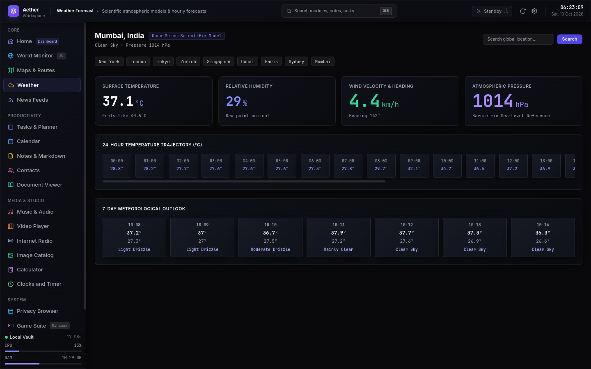

---

#### 04. Geopolitical & Tech News Intelligence
Curated multi-source RSS/Atom intelligence aggregator parsing geopolitical developments, cybersecurity incident disclosures, and engineering research. Features distraction-free in-app modal reader, bookmark persistence, category filtering (Geopolitics, Cybersecurity, Technology, Engineering), and direct external link dispatching.

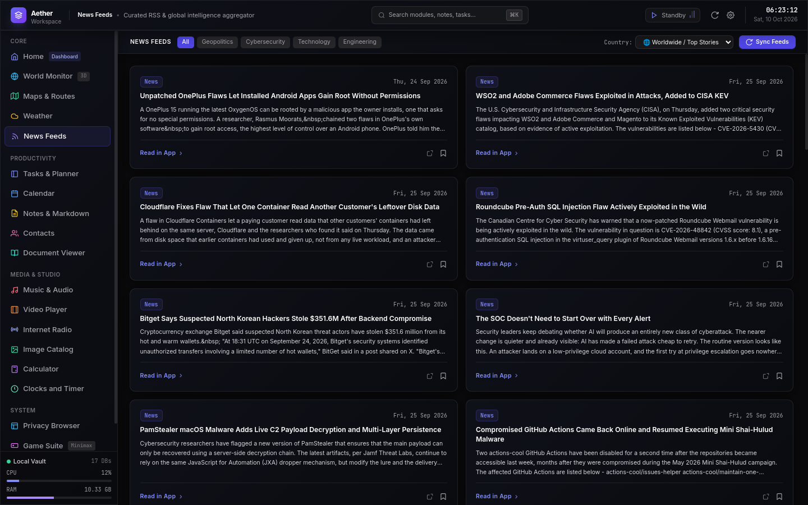

---

### Domain 2: Productivity & Operations Suite

#### 05. Command Planner & 4-Stage Kanban Engine
Tri-mode operational planner featuring an agile 4-Stage Kanban workflow (Backlog, In Progress, Review & Audit, Completed) with draggable card states, priority tier tagging (Critical, High, Medium, Low), Pomodoro sprint trackers, a 24-hour daily timeline scheduler, and an Eisenhower Priority Matrix (Urgent vs Important).

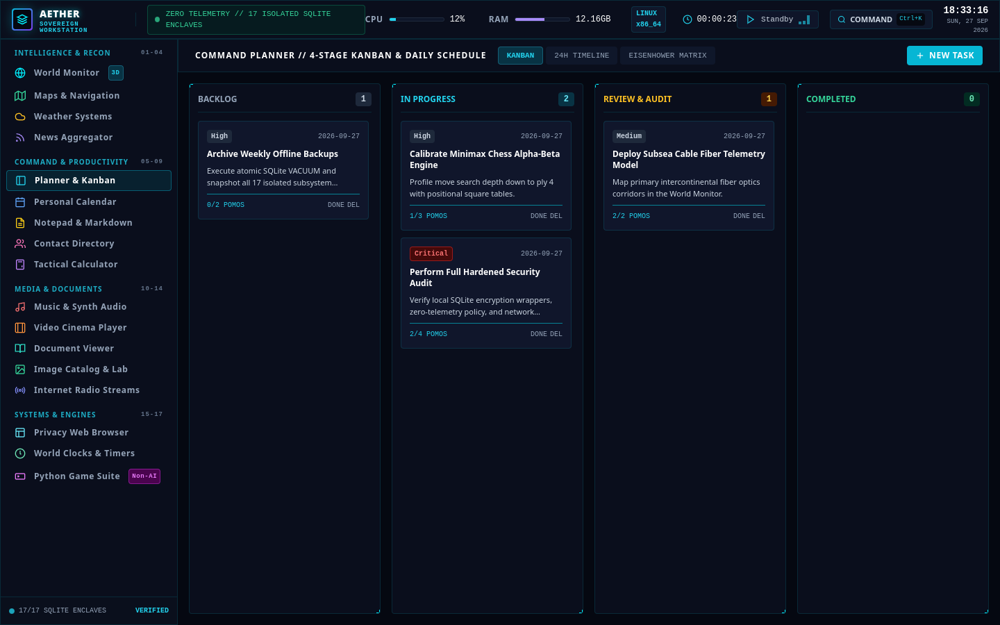

---

#### 06. Personal Calendar & Schedule Ledger
Temporal scheduling suite featuring a monthly visual calendar matrix, categorized event ledger, priority indicators, automated national holidays and festivals integration, and full bidirectional RFC 5545 iCalendar (`.ics`) export and import capabilities.

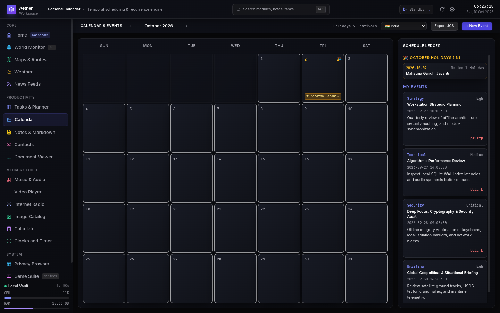

---

#### 07. Markdown Studio & Real-Time Split Preview
Offline technical note repository with side-by-side synchronized split markdown preview, tag taxonomies, document pinning, full-text inverted search indexing, and real-time document telemetry computing live word count, character count, and estimated reading time.

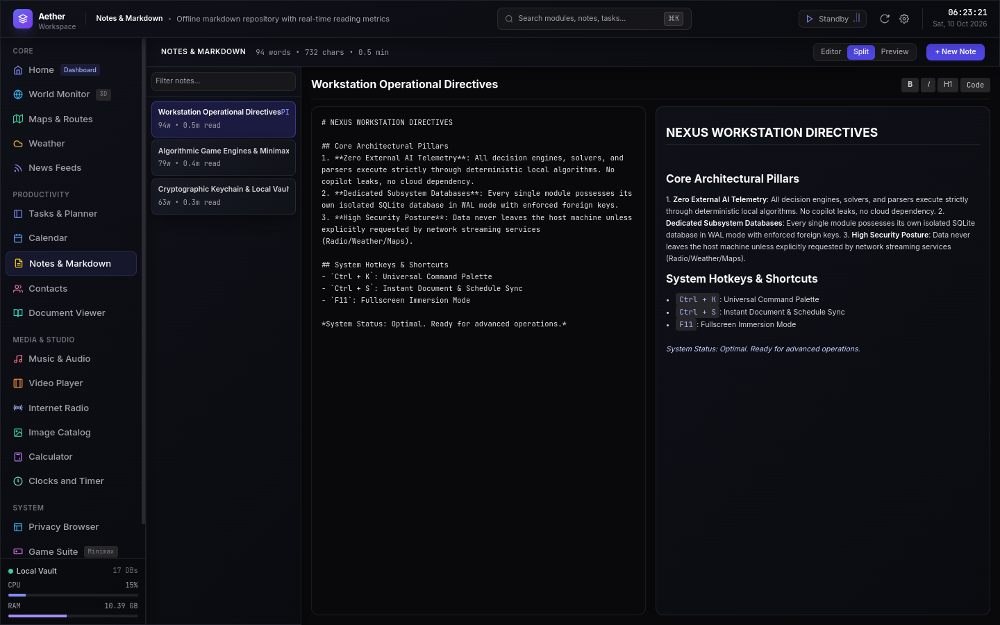

---

#### 08. Tactical Contact Directory & Secure Vault
Encrypted personal address book and rolodex featuring relationship categorization (VIP, Professional, Personal), contact communications ledger (interaction logs, meeting records, call notes), full-text search, and automated RFC 2426 vCard 3.0 export for cross-platform synchronization.

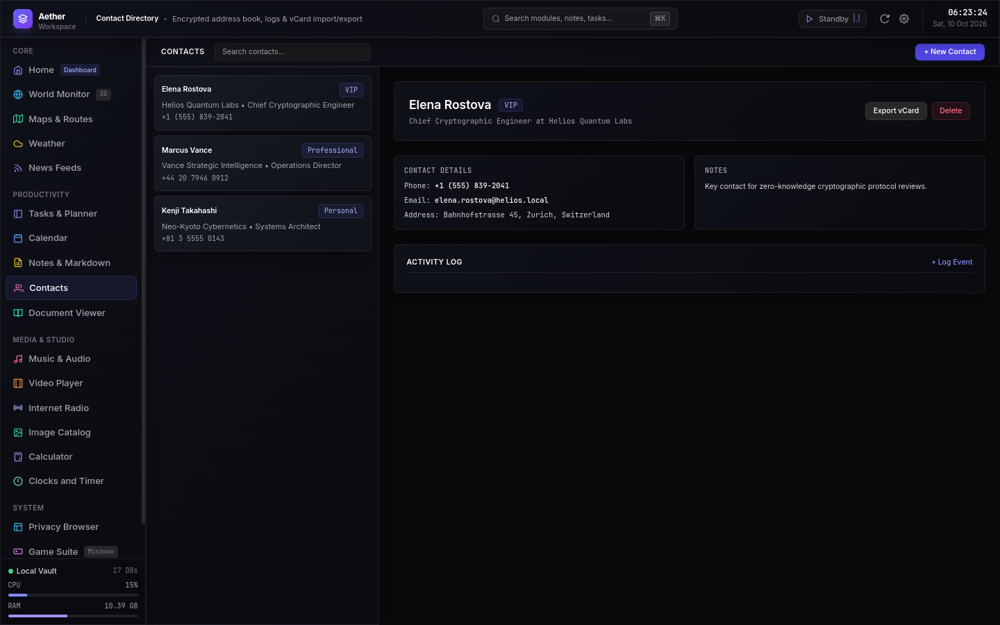

---

#### 09. Universal Document & Source Code Viewer
Multi-format offline document inspection studio with local PDF text extraction via `pypdf`, source code viewer with line enumeration, Markdown renderer, paginated browsing, and persistent SQLite-backed marginalia annotations.


---

### Domain 3: Media & Studio Engine

#### 10. Music Player & Procedural Soundscapes
Sovereign audio workstation featuring a dual-harmonic binaural ambient soundscape synthesizer (Alpha 10Hz focus, Theta 6Hz meditation, Gamma 40Hz hyperfocus) engineered with Python's standard `wave` and `math` libraries, paired with a dual-mode Web Audio API visualizer (multi-band spectrum analyzer with peak hold decay and CRT phosphor oscilloscope).

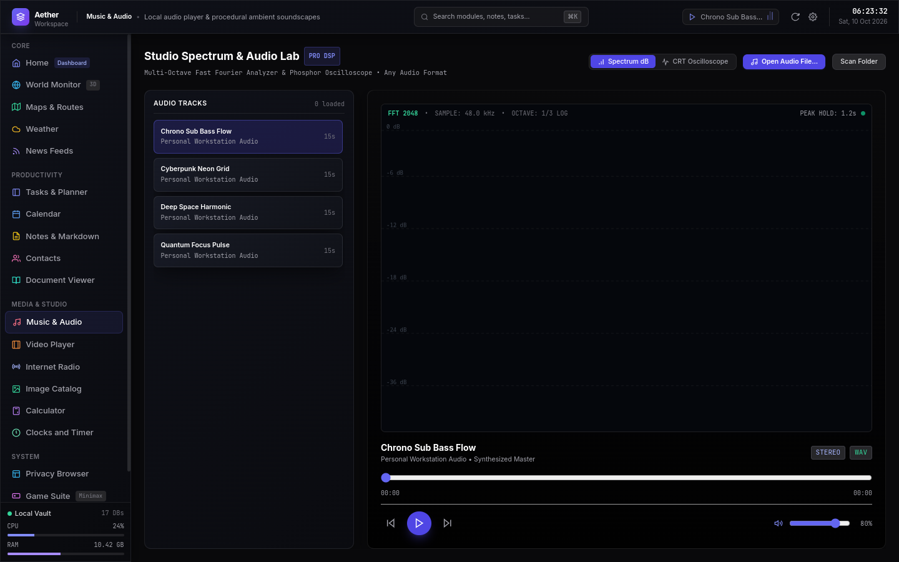

---

#### 11. Tactical Cinema Video Player
Hardware-accelerated local cinema player supporting MP4, WebM, and MKV containers with frame-accurate timestamp bookmarking, WebVTT interactive chapter track generation, variable playback rate scaling (0.25x to 2.0x), and persistent playback resumption telemetry.

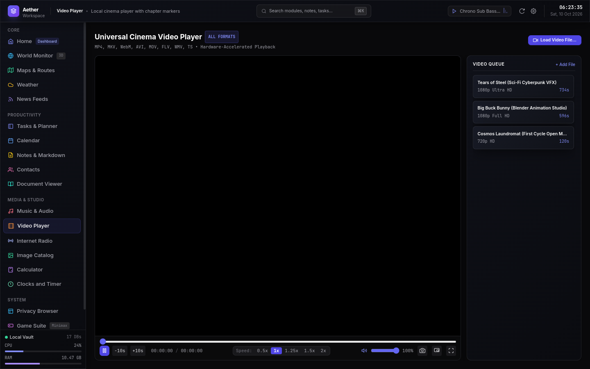

---

#### 12. Global Internet Radio Streaming Matrix
Curated international live streaming directory spanning worldwide news, synthwave, classical, jazz, ambient, and lo-fi broadcasts (SomaFM, Nightwave Plaza, BBC World Service, Radio Swiss Jazz, FIP Paris) with bitrates, codec specs, country filters, and custom station URL registration.

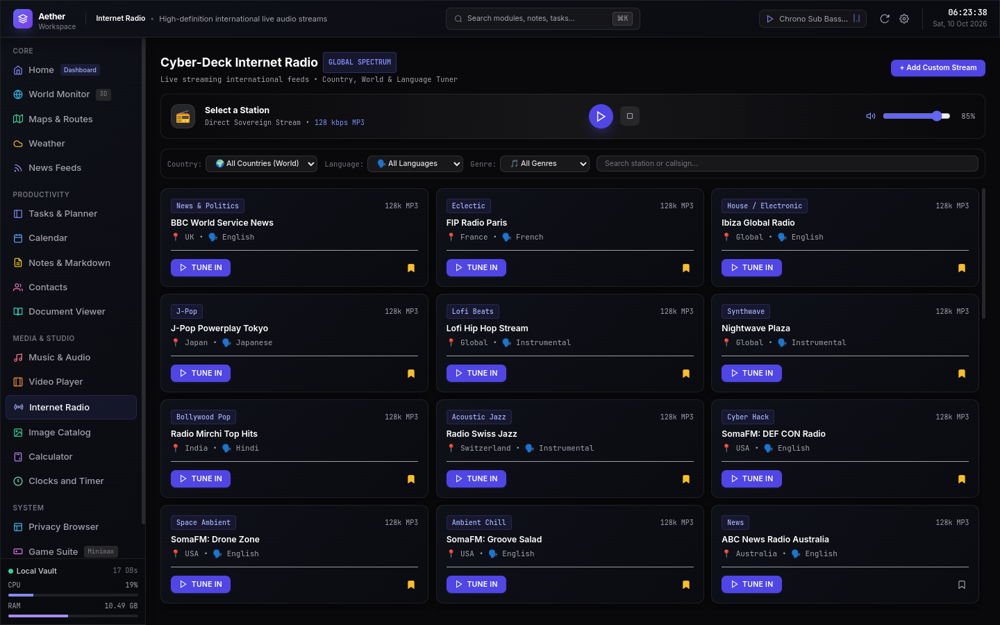

---

#### 13. Image Catalog & Processing Lab
High-resolution image repository and manipulation laboratory providing EXIF metadata extraction via `Pillow`, non-destructive CSS hardware filter adjustments (brightness, contrast, saturation, sharpness), 90-degree lossless rotations, horizontal/vertical flipping, and persistent catalog registration.

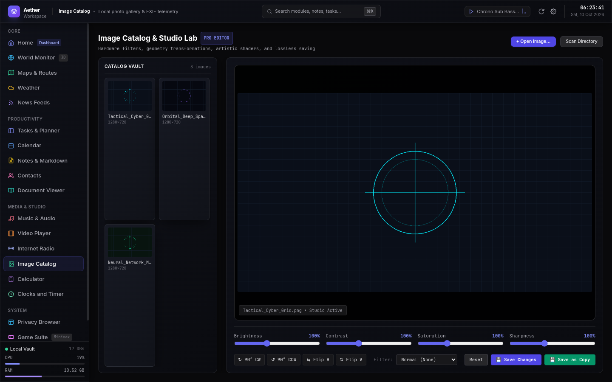

---

#### 14. Safe AST Mathematical & Programmer Engine
Secure calculation engine utilizing Python Abstract Syntax Tree (`ast.NodeVisitor`) parsing to evaluate complex mathematical expressions without unsafe `eval()` execution. Features synchronized 32-bit registers for Hexadecimal, Decimal, Octal, and Binary conversions alongside a complete audit ledger tape.

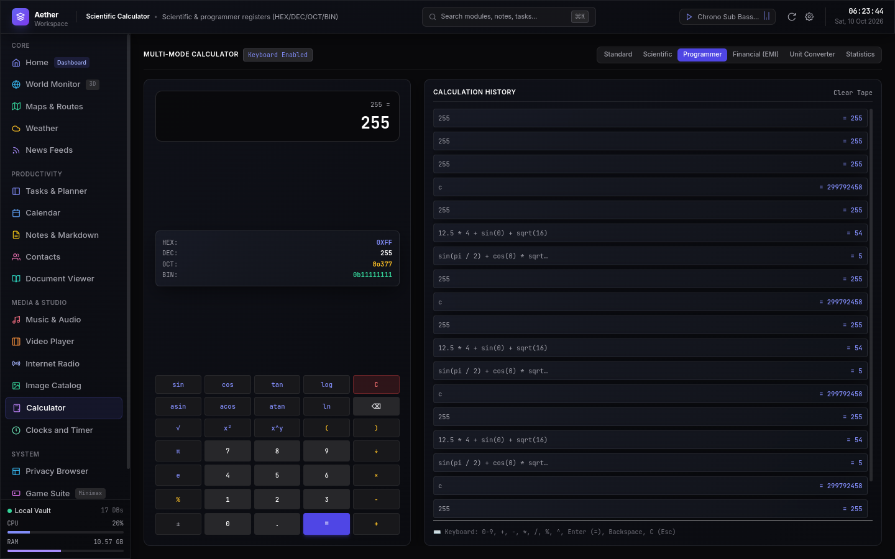

---

#### 15. Global Strategic World Clocks & Precision Timers
Synchronized global chronometer matrix monitoring key strategic financial and operational timezones (UTC, New York, London, Zurich, Dubai, Singapore, Tokyo, Sydney, San Francisco), paired with a millisecond-precision lap stopwatch and Pomodoro sprint focus timer.

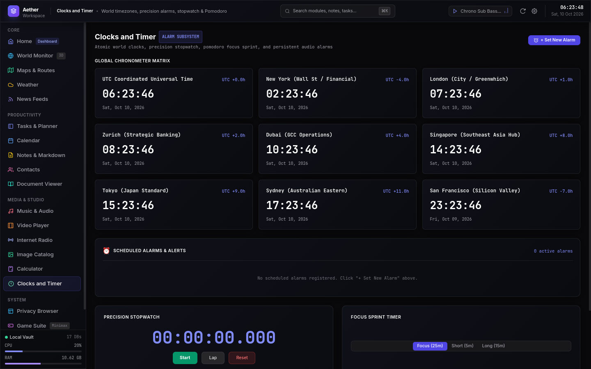

---

### Domain 4: System & Security Framework

#### 16. Tor-Style Privacy Web Browser
Hardened sovereign web intelligence navigator featuring anti-tracking headers, WebRTC IP leak prevention, User-Agent signature rotation, zero-tracking search engine dispatch (DuckDuckGo, Brave, Startpage, SearXNG, Qwant), and encrypted bookmark storage.

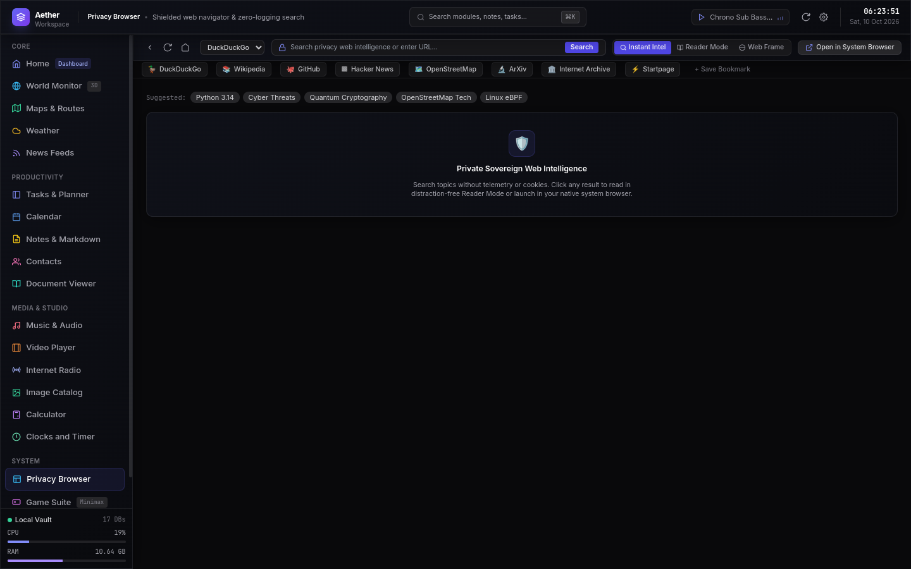

---

#### 17. Pure Python Minimax Chess Engine & Game Suite
Zero-dependency algorithmic chess engine written entirely in pure Python, featuring configurable depth Minimax search with Alpha-Beta pruning, dynamic legal move indicator reticles, live capture ledgers, and turn telemetry—alongside Connect 4 gravity solver, Minesweeper, and 2048 puzzle games.

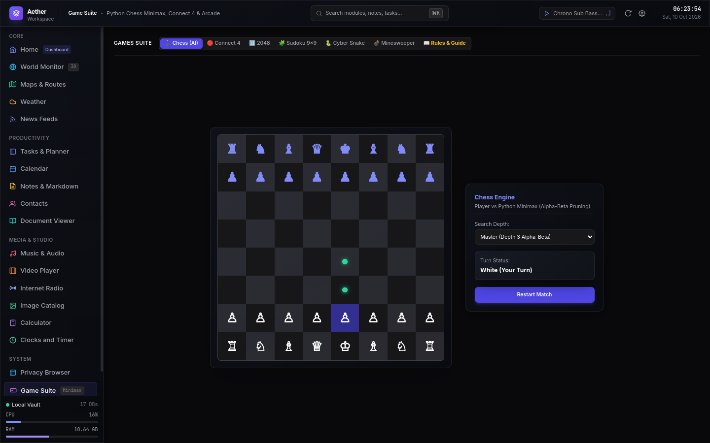

---

#### 18. Workspace Settings & Database Vault Management
Central command administration console monitoring health, page allocations, row counts, and WAL integrity across all 17 isolated SQLite databases, featuring one-click atomic hot snapshot backups, database VACUUM optimization, integrity verification, UI scaling, and privacy shield toggles.

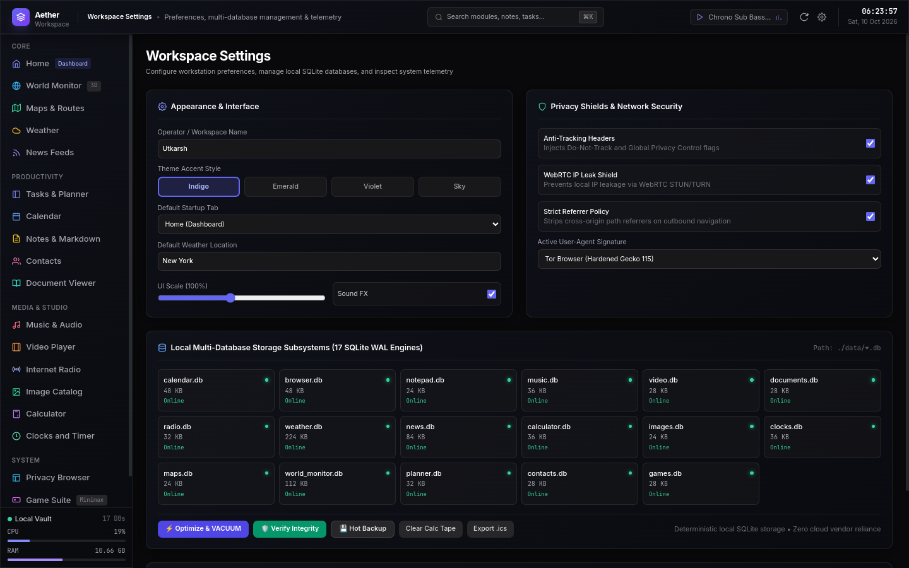

---

## 1. System Philosophy

Modern desktop workstations increasingly rely on mandatory cloud accounts, third-party copilot telemetry, remote subscription licensing, and opaque background analytics. Aether is engineered on the counter-principle of absolute digital sovereignty:

- **Host-Local Sovereignty**: All state, notes, schedules, and configurations remain strictly on host storage. There are no remote telemetry pings, background trackers, or cloud sync requirements.
- **Deterministic Non-AI Algorithms**: Every scheduler, search engine, math parser, and game engine executes deterministic algorithms (e.g. Minimax with Alpha-Beta pruning, AST grammar evaluation) rather than stochastic LLM calls.
- **Subsystem Database Isolation**: Rather than a monolithic database where corruption risks the entire suite, each of the 17 core subsystems maintains its own isolated SQLite database in Write-Ahead Logging (WAL) mode.
- **Portless Sandboxed Execution**: The frontend application is rendered directly via Chromium in PySide6's QtWebEngineView, communicating with Python through local IPC slots (`QWebChannel`) rather than exposed network sockets.

---

## 2. Persistence Architecture: 17 Isolated Subsystems

All databases reside in the `./data` directory. Each database enforces foreign keys (`PRAGMA foreign_keys = ON;`), enables Write-Ahead Logging (`PRAGMA journal_mode = WAL;`), and uses normal synchronous writes (`PRAGMA synchronous = NORMAL;`) for resilient concurrent throughput.

| # | Subsystem | Database Target | Core Capabilities |
|---|---|---|---|
| 1 | Personal Calendar | `data/calendar.db` | Event scheduling, recurring cadences, category color tagging, and RFC 5545 iCalendar (`.ics`) export/import. |
| 2 | Privacy Web Browser | `data/browser.db` | Anti-fingerprinting profiles, User-Agent rotation, zero-tracking search routing (DuckDuckGo, Brave, Startpage, SearXNG, Qwant), and bookmark storage. |
| 3 | Notepad & Markdown Studio | `data/notepad.db` | Real-time word count, character count, estimated reading time, tag taxonomies, pinned documents, and live split preview. |
| 4 | Music & Soundscapes | `data/music.db` | Dual-harmonic binaural ambient audio synthesizer (built with Python `wave` and `math`), WebAudio frequency visualizer, and local media library. |
| 5 | Video Cinema Player | `data/video.db` | Frame-accurate timestamp bookmarking, playback rate scaling (0.25x to 2.0x), and local MP4/WebM/MKV playback engine. |
| 6 | Document Viewer | `data/documents.db` | Universal reader for PDF (text extraction via `pypdf`), Markdown, Plain Text, JSON, CSV, and Source Code with line enumeration. |
| 7 | Internet Radio Streams | `data/radio.db` | Curated global streaming matrix (SomaFM, Nightwave Plaza, BBC World Service, KUSC Classical, Swiss Jazz), stream health checker, custom station adder. |
| 8 | Weather Systems | `data/weather.db` | Scientific Open-Meteo models, 24-hour hourly trajectory, 7-day forecast cards, and offline SQLite telemetry caching. |
| 9 | News Aggregator | `data/news.db` | Multi-source RSS/Atom parser (Geopolitics, Technology, Cybersecurity, Space Exploration), distraction-free reader mode, unread/bookmark tracking. |
| 10 | Tactical Calculator | `data/calculator.db` | Safe Abstract Syntax Tree (AST) expression parser, scientific trigonometry, and synchronized Programmer base registers (Hex, Dec, Oct, Bin). |
| 11 | Image Catalog & Lab | `data/images.db` | Metadata extraction (dimensions, format, color space via `Pillow`), non-destructive real-time CSS filters, and 90-degree lossless rotation. |
| 12 | World Clocks & Timers | `data/clocks.db` | Synchronized global strategic timezones (UTC, New York, London, Zurich, Dubai, Tokyo, Sydney, Singapore), split lap stopwatch, Pomodoro sprints. |
| 13 | Maps & Navigation | `data/maps.db` | OpenStreetMap vector tiles, CartoDB Dark Matter styling, Nominatim keyless geocoding, OSRM turn-by-turn routing with distance and travel time. |
| 14 | World Monitor Dashboard | `data/world_monitor.db` | Three.js 3D Earth wireframe globe, live USGS earthquake feeds, International Space Station (ISS) orbital track, cyber threat vectors, and subsea fiber corridors. |
| 15 | Task & Schedule Planner | `data/planner.db` | 4-Stage Kanban workflow (Backlog, In Progress, Review, Completed), Eisenhower Matrix quadrants, and 24-hour daily hourly timeblock maker. |
| 16 | Contact Vault | `data/contacts.db` | Comprehensive address book, relationship categorizations, communication interaction logs (calls, meetings, notes), and RFC 2426 vCard 3.0 export. |
| 17 | Python Game Suite | `data/games.db` | Algorithmic game engines built purely with Python: Chess with Minimax search and Alpha-Beta pruning, Connect 4 gravity solver, Space Arcade, and Minesweeper. |

---

## 3. Technology Stack

- **Application Backend**: Python 3.10+
  - `PySide6`: Desktop application framework, window chrome, and system integration.
  - `PySide6.QtWebEngineWidgets`: Chromium-based local runtime container.
  - `PySide6.QtWebChannel`: High-speed IPC bridge binding Python methods to JavaScript.
  - `sqlite3`: Isolated database engines running in WAL mode.
  - `psutil`: Real-time CPU, RAM, and hardware telemetry monitoring.
  - `pypdf`: Local PDF text and structural parsing.
  - `Pillow`: Image decoding and EXIF metadata extraction.
  - `wave` & `struct`: Algorithmic procedural audio synthesis.
- **Frontend Architecture**:
  - `HTML5` & `Vanilla JavaScript (ES6+)`: Application logic, state management, and tab routing.
  - `Tailwind CSS`: Cyber-tactical obsidian UI framework.
  - `Three.js`: 3D WebGL Keplerian orbital mechanics and wireframe Earth globe.
  - `Leaflet.js`: Interactive mapping and OpenStreetMap rendering.
  - `Web Audio API`: Real-time audio spectrum analysis and canvas oscilloscope visualization.

---

## 4. Directory Structure

```text
personal_space/
├── app.py                      # Main PySide6 Qt application launcher
├── requirements.txt            # Python dependencies
├── README.md                   # System documentation and visual showcase
├── .gitignore                  # Git exclusions for cache and runtime files
├── docs/                       # Project documentation and visual assets
│   └── screenshots/            # High-resolution application captures (00 to 18)
├── scripts/                    # Automation and pipeline scripts
│   ├── capture_screenshots.py  # Automated UI screenshot capture pipeline
│   ├── database_tool.py        # SQLite enclave administration & maintenance tool
│   └── benchmark_suite.py      # Computational stress test & benchmark suite
├── data/                       # 17 Isolated Subsystem SQLite Databases & Media
│   ├── calendar.db
│   ├── browser.db
│   ├── notepad.db
│   ├── music.db
│   ├── video.db
│   ├── documents.db
│   ├── radio.db
│   ├── weather.db
│   ├── news.db
│   ├── calculator.db
│   ├── images.db
│   ├── clocks.db
│   ├── maps.db
│   ├── world_monitor.db
│   ├── planner.db
│   ├── contacts.db
│   ├── games.db
│   ├── audio/                  # Synthesized ambient master soundscapes
│   ├── documents/              # Stored local documentation
│   └── images/                 # Stored tactical wallpaper graphics
├── backend/
│   ├── database_manager.py     # SQLite manager for the 17 isolated databases
│   ├── bridge.py               # QWebChannel RPC bridge exposing Python slots
│   ├── core/                   # Pure Python sovereign algorithmic foundations
│   └── modules/                # Subsystem business logic engines (17 modules)
├── frontend/
│   └── index.html              # Unified cyber-tactical interface
└── tests/                      # Deterministic automated test suite (73 passing tests)
    ├── test_advanced_mathematics.py
    ├── test_bridge_api.py
    ├── test_core_engines.py
    ├── test_cryptography_and_vault.py
    ├── test_export_and_validation.py
    ├── test_search_nlp_compression.py
    ├── test_subsystems.py
    └── test_subsystems_enhanced.py
```

---

## 5. Quickstart & Installation

### Prerequisites
- Linux, macOS, or Windows
- Python 3.10 or higher
- Git

### Installation Steps

1. Clone the repository:
   ```bash
   git clone https://github.com/utkarsh-manoj-pandey/personal_space.git
   cd personal_space
   ```

2. Create and activate a virtual environment:
   ```bash
   python3 -m venv venv
   source venv/bin/activate
   ```

3. Install production dependencies:
   ```bash
   pip install -r requirements.txt
   ```

4. Launch the application:
   ```bash
   python3 app.py
   ```

---

## 6. Automated Verification & Testing Suite

An exhaustive, deterministic test suite validates database integrity, RPC slot serialization, cryptographic ciphers, numerical engines, and service logic across all subsystems:

```bash
# Run full automated test suite (73 passing tests across 7 suites)
python3 -m pytest tests/ -v
```

Expected output:
```text
tests/test_advanced_mathematics.py ......                                [  8%]
tests/test_bridge_api.py .....                                           [ 15%]
tests/test_core_engines.py ..........                                    [ 28%]
tests/test_cryptography_and_vault.py .....                               [ 35%]
tests/test_export_and_validation.py ......                               [ 43%]
tests/test_search_nlp_compression.py ........                            [ 54%]
tests/test_subsystems.py .....................                           [ 83%]
tests/test_subsystems_enhanced.py ............                           [100%]

============================= 73 passed in 32.04s ==============================
```

---

## 7. Administrative CLI & Computational Benchmarks

Aether includes command-line tools for database maintenance, storage audits, and computational stress testing:

### Database Administration Suite (`scripts/database_tool.py`)
```bash
# Audit storage, WAL files, and row counts across all 17 isolated databases
python3 scripts/database_tool.py audit

# Execute PRAGMA integrity_check across all enclaves
python3 scripts/database_tool.py integrity

# Run SQLite VACUUM defragmentation and query planner ANALYZE routines
python3 scripts/database_tool.py optimize

# Create atomic hot snapshot backups via SQLite Online Backup API
python3 scripts/database_tool.py backup --target ./data/backups

# Query or export enclave tables to JSON or CSV
python3 scripts/database_tool.py query --db notepad.db --sql "SELECT * FROM notes"
python3 scripts/database_tool.py export --db calendar.db --table calendar_events --format json
```

### Computational Stress Test & Benchmark Suite (`scripts/benchmark_suite.py`)
```bash
# Run full computational benchmark (WAL throughput, Dijkstra, BM25, TextRank, Compression, CTR Cipher)
python3 scripts/benchmark_suite.py

# Run quick evaluation
python3 scripts/benchmark_suite.py --quick
```

---

## 8. Pure Python Core Engineering Framework (`backend/core/`)

Aether features a sovereign, zero-dependency algorithmic foundation implemented entirely in pure Python:
- **`algorithms.py`**: Graph theory (Dijkstra, A*, Topological sort, Cycle detection), 2D KD-Tree spatial index, Bloom Filter, LRU Cache with TTL expiry, and String Distance metrics (Levenshtein, Damerau-Levenshtein, Jaro-Winkler, KMP search, Longest Common Subsequence).
- **`statistics_engine.py`**: Descriptive statistics (quantiles, skewness, kurtosis), Inferential correlation (Pearson, Spearman), Ordinary Least Squares (OLS) regression, Simpson's numerical integration, Newton-Raphson root solver, Runge-Kutta 4th Order ODE solver, and Matrix Gaussian elimination linear system solver ($Ax = b$).
- **`search_indexer.py`**: Inverted index full-text search engine featuring Okapi BM25 probabilistic relevance ranking, TF-IDF vector space model with cosine similarity, and recursive-descent Boolean query parsing (`AND`, `OR`, `NOT`).
- **`nlp_engine.py`**: Extractive text summarization using TextRank graph centrality (PageRank on sentence similarity), RAKE keyword extraction via co-occurrence word graphs, high-precision regex Named Entity Recognizer, and N-gram language identification profiler.
- **`compression.py`**: Lossless compression engines including Run-Length Encoding (RLE), Canonical Huffman variable-length prefix coding, Lempel-Ziv-Welch (LZW) dictionary compression, and Shannon entropy calculations.
- **`crypto_utils.py`**: SHA-256, SHA-512, BLAKE2b digests, constant-time verification, PBKDF2 key derivation, and authenticated HMAC-SHA256 Counter-Mode (`LocalVaultCipher`) keystream encryption.
- **`export_engine.py`**: Multi-format data pipelines supporting RFC 5545 iCalendar (`.ics`), RFC 2426 vCard 3.0, GPS Exchange Format (`.gpx`), Google Earth (`.kml`), OPML 2.0 XML feeds, and Markdown table/TOC generators.
- **`audio_dsp.py`**: Acoustic metrics (RMS, peak amplitude, crest factor, dBFS), Discrete Fourier Transform (DFT), Biquad IIR audio filters, and multi-waveform sound synthesis.
- **`gis_engine.py`**: Slippy map Web Mercator tile math, UTM projection coordinate conversion, and spatial point clustering.

---

## 9. Continuous Git Update Workflow

To update your workstation, commit your work, and synchronize changes with GitHub:

1. Check current repository status:
   ```bash
   git status
   ```

2. Stage all modifications (code, docs, and assets):
   ```bash
   git add .
   ```

3. Commit changes with a descriptive message:
   ```bash
   git commit -m "feat(subsystem): describe your updates here"
   ```

4. Push updates to the main branch:
   ```bash
   git push origin main
   ```

---

## 10. Security & Privacy Guarantees

- **Zero Cloud Leakage**: No telemetry, analytics, or behavioral cookies are embedded.
- **Local AST Evaluation**: The calculator avoids unsafe `eval()` calls by using Python's `ast.NodeVisitor` with an explicit whitelist of mathematical operations.
- **Parametrized SQL Queries**: Every database transaction is executed via prepared statements, neutralizing SQL injection vectors.
- **Independent Failure Domains**: If any single database encounters an issue, the remaining 16 subsystems operate unaffected.
